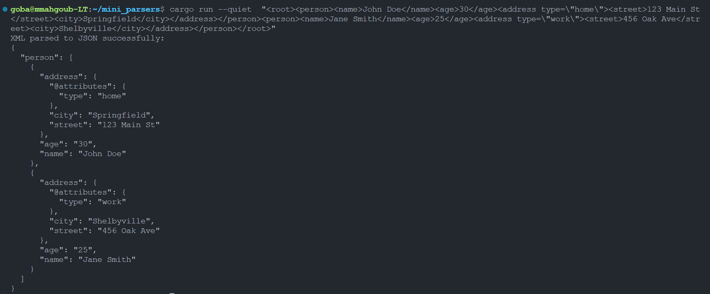
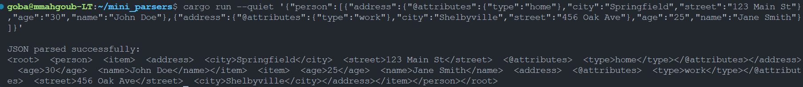

# Mini Parsers: XML ↔ JSON  

## Description  
This repository contains **custom parsers** for XML and JSON written in **Rust**, designed for learning and exploring the language. The parsers support:  
- **XML Parsing**: Handles tags, attributes, nested elements, and text nodes.  
- **JSON Parsing**: Processes null, booleans, numbers, strings, arrays, and objects.  
- **Conversion**: Bi-directional conversion between XML and JSON formats.  

## Features  
### XML Parser  
- Parses XML into a structured Rust `XmlNode`.  
- Handles attributes and nested child nodes.  
- Supports text content within nodes.  

### JSON Parser  
- Parses JSON into a custom `JsonValue` structure.  
- Supports all JSON data types, including nested arrays and objects.  

### Conversion  
- Converts XML to JSON and JSON back to XML while maintaining structural integrity.  

## Purpose  
This project was developed as a **learn-by-doing** exercise to dive deeper into **Rust's core features** like ownership, error handling, and efficient string processing.  

## Getting Started  
1. Clone the repository:  
   ```bash  
   git clone https://github.com/momahgoub172/mini_parsers.git  
   ```  
2. Navigate to the directory:  
   ```bash  
   cd mini_parsers  
   ```  
3. Run the project examples:  
   ```bash  
   cargo run  
   ```  

## Example Usage  
### XML to JSON:  
Input XML:  
```xml  
<person>  
    <name>John Doe</name>  
    <age>30</age>  
</person>  
```  
Output JSON:  
```json  
{  
    "person": {  
        "name": "John Doe",  
        "age": 30  
    }  
}  
```


### JSON to XML:  
Input JSON:  
```json  
{  
    "person": {  
        "name": "John Doe",  
        "age": 30  
    }  
}  
```  
Output XML:  
```xml  
<person>  
    <name>John Doe</name>  
    <age>30</age>  
</person>  
```


## Contributions  
Contributions, issues, and feature requests are welcome! Feel free to fork the repository and make a pull request.  

## License  
This project is licensed under the MIT License.  

---  
Happy Parsing! 😊
